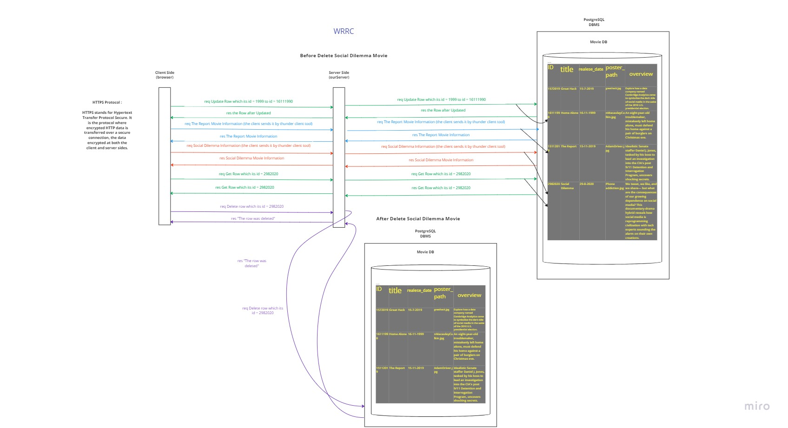

# Movies-Library - 1.00

**Author Name : Doha Khamaiseh**

## WRRC :

## Overview :
  *Firstly, we created a server.js file and initialize it.Secondly, we installed express and cors frameworks, the first one is to ease creating apps and saves a lot of coding time, and the second one is to make the server open for all client requests .Thirdly, we started building the server.js file by specifying a port number for it then sending requests and receiving responses. Finally, we let our server start working*

## Update Overview #1:
*As an update, we took our data which is movies not from the data.json file but from 3rd  party API and gave it to our server, so when we send a request by using our browser, it will go to our server then our server will send a request for 3rd party API to get a response then give this response to the client who is our browser*

## Update Overview #2:
*Instead of taking the movies information from The Movie DB API like last lab, now  we will take  the movies information from Postgresql DBMS and send them back to the client but initially, we took this information from the client when he/she entered it by using Thunder Client Tool*

## Update Overview #2:
*here we made our App a CRUD App, which means the client can Create,  Read, Update, and Delete from the Movie Table, and we used Path Parameters way to specify the wanted row by its ID*

## Getting Started :
*1- clone our Repo. in their machines. 2-install express and cors by writing this command on the Terminal: npm install express cors 3- let the server start working by writing  this command on the Terminal: npm start 4- enter the URL for the route in the browser to see the results*

## Project Features : 
*1- can using it get the data information 2- open a Favorite page which will have this message: Welcome to Favorite Page 3- open a 500 status error page which will print this:  500,"Sorry, something went wrong" 4- can check by using it if the user enters an undefined route by printing this message if he did:   404," page not found error"*