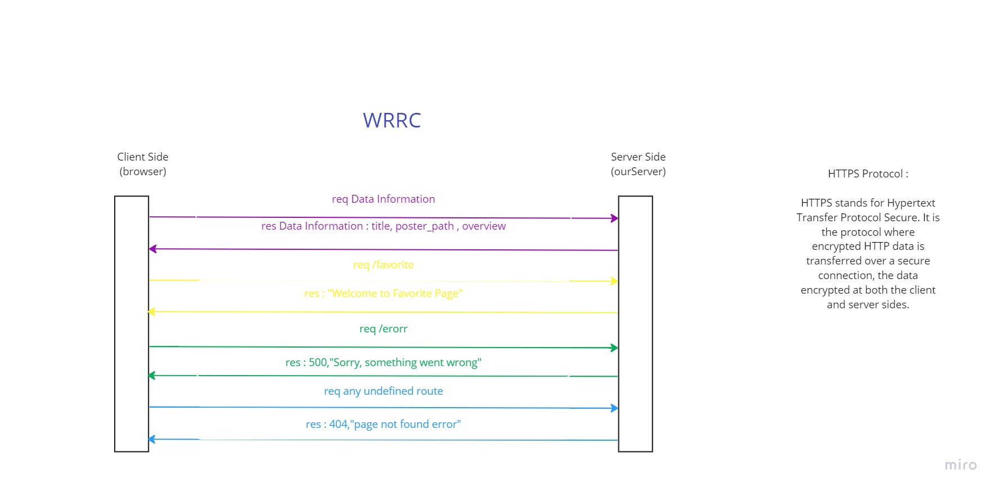

# Movies-Library - 1.00

**Author Name : Doha Khamaiseh**

## WRRC :

## Overview :
  *Firstly, we created a server.js file and initialize it.Secondly, we installed express and cors frameworks, the first one is to ease creating apps and saves a lot of coding time, and the second one is to make the server open for all client requests .Thirdly, we started building the server.js file by specifying a port number for it then sending requests and receiving responses. Finally, we let our server start working*

## Getting Started :
*1- clone our Repo. in their machines. 2-install express and cors by writing this command on the Terminal: npm install express cors 3- let the server start working by writing  this command on the Terminal: npm start 4- enter the URL for the route in the browser to see the results*

## Project Features : 
*1- can using it get the data information 2- open a Favorite page which will have this message: Welcome to Favorite Page 3- open a 500 status error page which will print this:  500,"Sorry, something went wrong" 4- can check by using it if the user enters an undefined route by printing this message if he did:   404," page not found error"*